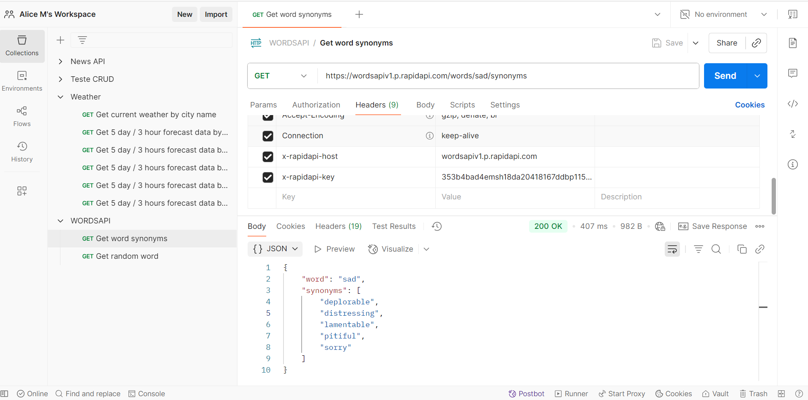
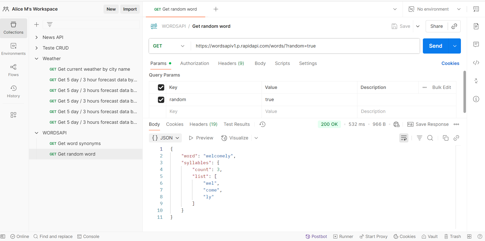
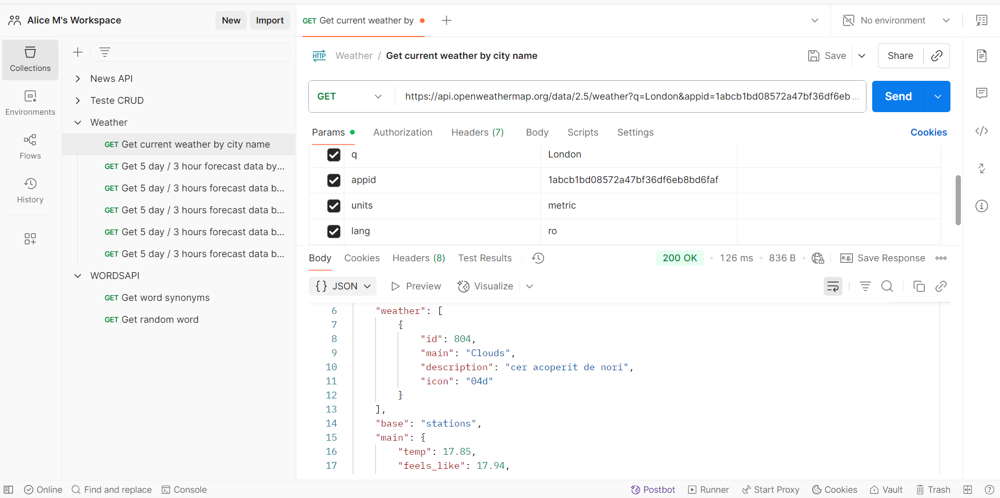
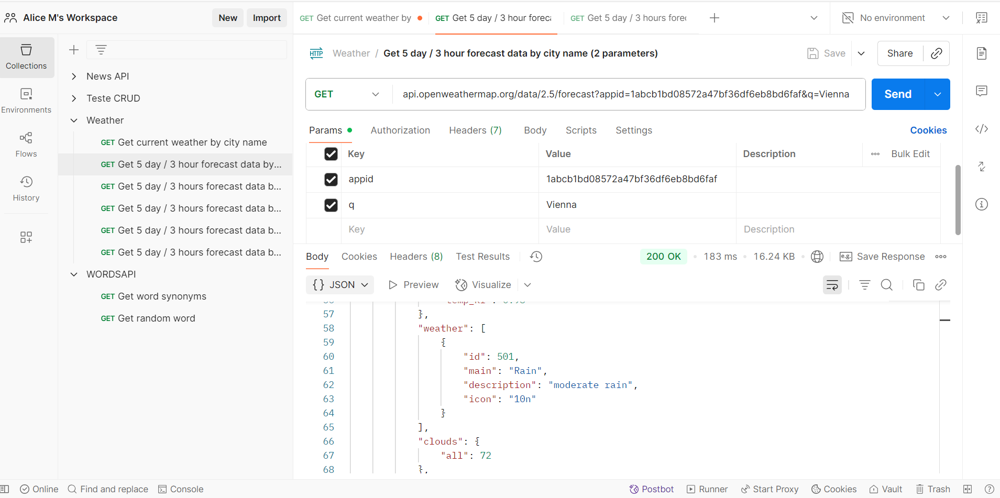

# API-Testing-Portfolio

## API Test – Retrieve synonyms for the word "sad" (WordsAPI)

### Project Overview

This project contains automated tests for the WordsAPI /words/{word}/synonyms endpoint, which returns synonyms for a given word.

### Tested Endpoint

GET https://wordsapiv1.p.rapidapi.com/words/sad/synonyms 

Example tested with the word: sad 

### Request Details

Method: GET 

URL: https://wordsapiv1.p.rapidapi.com/words/sad/synonyms 

Headers:

  - x-rapidapi-host: wordsapiv1.p.rapidapi.com
  - x-rapidapi-key: Your API Key (353b4bad4emsh18da20418167ddbp1154adjsn57bf237f2a94)

### Project Structure

  - **API Test in Postman:** The test is configured in Postman and can be run directly from the application.
  - **The purpose of this test is to verify:**
    
    - The API returns a successful HTTP status code (200 OK);
    - The response contains the expected word property with the correct value;
    - The response contains a non-empty array of synonyms;
    - Each synonym in the array is a string.
    

### Steps to run the test

  1. In Postman, insert the Endpoint
  2. Add required headers (x-rapidapi-key, x-rapidapi-host)
  3. Click on the "Send" button to execute the test
  4. Review the results in Postman’s console to determine which tests were successful and which failed

### Test Details

  1. Response Status Code: Verifies that the API returns a 200 / Success status code, indicating the request was successful.
  
  2. Word Property: Ensures that the response contains the property "word" with the correct value (e.g., "sad").
  
  3. Synonyms Array Exists: Confirms that the API returns a non-empty array of synonyms.
  
  4. Synonyms Data Type: Checks that each item in the synonyms array is a string, ensuring data consistency.

### Test Results

  - If all tests pass successfully, the API correctly returns a valid list of synonyms for the requested word.
  - Postman will indicate any failed tests and provide information to help identify the issue.

### Example

---

## API Test: Getting a Random Word from WordsAPI 

### Project Overview

This project contains an automated test for the WordsAPI endpoint that returns a random word. The test verifies that the API responds successfully and returns a valid random word in the expected format.

### Tested Endpoint

GET https://wordsapiv1.p.rapidapi.com/words/

### Parameters

  - random = true  (requests a random word)

### Project Structure

  - **API Test in Postman:** The test is configured in Postman and can be run directly from the application.

  - **Key Validations:**
    
    - Verify the response status code is 200 OK;
    - Confirm that the response contains a non-empty word field;
    - Ensure the returned word is a string and follows expected format (no numbers or special characters).
   
### Steps to run the test

  1. Open Postman and create a new GET request
  2. Enter the endpoint URL with the query parameter random=true
  3. Add the required headers for authentication (x-rapidapi-key)
  4. Click Send to execute the request
  5. Check the response and test results in Postman's Body and Console.

### Test Details 

  - **Response Status Code:** Validates the request succeeds with a 200 OK.
  - **Word Field:** Ensures the word property is present and contains a valid string representing the random word.

### Test Results

  - Passing tests confirm the API returns a valid random word with a successful response.
  - If any tests fail, Postman displays the errors to help identify and resolve the issues.

### Example

---

## API Test: Get current weather by city name using [api.openweathermap.org ](https://openweathermap.org/api) 

### Project Overview 

This project contains automated tests for the OpenWeatherMap /data/2.5/weather endpoint, which returns the current weather data for a specific city.

The purpose of this test is to verify:

- That the API returns a successful response (status code 200);
- That the city name in the response matches the requested city;
- That essential weather-related properties are present in the response (e.g., temperature, humidity, weather description);
- That values are in expected formats and units (e.g., temperature in Celsius, language in Romanian).

### Tested Endpoint

GET [https://api.openweathermap.org/data/2.5/weather](https://api.openweathermap.org/data/2.5/weather) 

### Parameters

  - q: city name; in this case: "London"
  - appid: unique API key
  - (Optional) units: units of measurement;
  
Temperature is available in Fahrenheit, Celsius and Kelvin units.

For temperature in Fahrenheit use units = imperial;
For temperature in Celsius use units = metric;
  
Temperature in Kelvin is used by default, no need to use units parameter in API call. In this case: 'metric';

  - (Optional) lang: specifies the desired language for the response; Translation is applied to selected fields, including the city name and weather description. In this case: 'ro'; 

### Project Structure 

  - **API Test in Postman:** The test is configured in Postman and can be executed directly within the application.
  - **The test verifies the following aspects:**
    
      - The API returns a 200 OK status code, confirming that the request was successful;
      - The response contains valid weather data for London;
      - Essential fields such as temperature, humidity, and weather description are present in the response;
      - The temperature is displayed in Celsius, as defined by the units=metric parameter;
      - The weather description is returned in Romanian, according to the lang=ro parameter.

### Steps to run the test

  1. In Postman, enter the endpoint URL: https://api.openweathermap.org/data/2.5/weather
  2. Add the following query parameters:
   
      - q: London
      - appid: 1abcb1bd08572a47bf36df6eb8bd6faf
      - units: metric (for Celsius)
      - lang: ro (for Romanian language)
  
    3. Click the Send button to execute the request
    4. Review the test results in Postman’s Tests tab or console, where each validation will indicate pass or fail status

### Test Details

  - **Response Status Code:** Confirms that the API returns a 200 OK status code, indicating that the request was successfully processed.
  - **City Match:** Verifies that the returned weather data corresponds to the specified city ("London").
  - **Essential Fields:** Checks that the response includes key weather attributes such as: temperature, humidity, weather description, and wind speed.

### Test Results

  - If all validations pass, the API correctly returns accurate and localized weather data for the specified city.
  - If any validation fails, Postman will clearly indicate which check did not pass and provide relevant details to support   debugging and troubleshooting.
  - A successful test run confirms the API’s correct behavior regarding response structure, data accuracy, unit format, and   language translation.

### Example

   

---

## API Test: 5 Day / 3 Hour Forecast by city name (2 parameters)

### Project Overview

This project contains an automated API test for the OpenWeatherMap 5-Day/3-Hour Forecast API, which returns weather forecast data for the next 5 days in 3-hour intervals.

The test is designed to verify that the API correctly returns forecast data for Vienna, with essential weather fields present in the response and values formatted according to the provided parameters.

### Tested Endpoint

GET https://api.openweathermap.org/data/2.5/forecast 

### Parameters

  - q: City name (Vienna) 
  - appid: API key (1abcb1bd08572a47bf36df6eb8bd6faf) 

### Project Structure

  -**API Test in Postman:** The request and its automated tests are configured in Postman and can be executed directly. 
  - **Validation checks include:**
    
    - Verifying that the API returns a 200 OK response;
    - Checking that the response contains forecast data for the correct city (Vienna);
    - Confirming that forecast data is returned in 3-hour intervals;
    - Ensuring that each forecast entry contains the following fields:
          - dt_txt: Date and time of the forecast
          - main.temp: Temperature
          - main.humidity: Humidity
          - weather[0].description: Weather condition description
       
### Steps to run the test

    1. Open Postman and insert the request endpoint
    2. Set the required query parameters:
    
      - q: the city name (Vienna)
      - appid: unique API key (1abcb1bd08572a47bf36df6eb8bd6faf)
    
    3. Click the "Send" button to run the request
    4. Review the test results in Postman’s console to see which tests passed or failed

### Test Details

  -**Response Status Code:** Verifies that the API returns a 200 OK status code, indicating the request was successful;
  -**City Validation:** Confirms that the city returned in the response matches the requested city (Vienna);
  -**Forecast Interval Verification:** Ensures the weather forecast data is provided in 3-hour intervals, as specified by the API
  -**Field Presence:** Checks that each forecast entry contains essential fields: 
  
    * dt_txt (date and time of the forecast) 
    * main.temp (temperature) 
    * main.humidity (humidity) 
    * weather[0].description (weather condition description)  

  ### Test Results

  - If all validations pass, the API correctly provides accurate and structured forecast data for the specified city.
  - If any validation fails, Postman will indicate which specific check did not pass and display detailed output to help with debugging.
  - A successful test confirms that the endpoint returns weather forecasts in the expected 3-hour intervals and includes all required fields such as temperature, humidity, and weather descriptions.

### Example:

  

---

## API Test – Retrieve 5 Day / 3 Hour Weather Forecast in XML Format by City Name (OpenWeatherMap)

### Project Overview

This project contains an API test for the OpenWeatherMap forecast endpoint. The purpose is to verify that the API successfully returns weather forecast data in XML format for a specified city, including key forecast details over a 5-day period with 3-hour intervals.

### Tested Endpoint

GET https://api.openweathermap.org/data/2.5/forecast 

### Parameters

  - q: City name (Vienna)
  - appid: API key (1abcb1bd08572a47bf36df6eb8bd6faf)
  - mode: Response format (xml)

### Project Structure

  - **API Test in Postman:** The test is created in Postman and can be executed directly from the interface.
  - **This test verifies the following aspects of the API response:**
    
    - Verifying that the response status is 200 OK;
    - Confirming that the response format is XML;
    - Checking that the city returned matches the query;
    - Ensuring that forecast data is present and structured by 3-hour intervals;
    - Verifying the presence of essential forecast fields: temperature, humidity.

### Steps to run the test

    1. Open Postman and create a new GET request
    2. Insert the following endpoint: api.openweathermap.org/data/2.5/forecast?appid=1abcb1bd08572a47bf36df6eb8bd6faf&q=Vienna&mode=xml
    3. Ensure the request method is set to GET
    4. Add or confirm the required query parameters:
   
      - q: the city name (Vienna)
      - appid: a valid API key (1abcb1bd08572a47bf36df6eb8bd6faf)
      - mode: xml
       
    6. Click the Send button to execute the request
    7. View the response and verify test results in Postman's Body and Console tabs.

### Test Details

  -**Response Status Code:** Confirms that the API returns a 200 OK status, indicating a successful request. 
  -**Response Format:** Validates that the response is in XML format, as specified by the mode=xml parameter.
  -**City Verification:** Ensures the <name> tag inside the <location> element corresponds to the requested city (Vienna).
  -**Forecast Data Presence:** Checks that the response contains multiple <time> elements representing 3-hour forecast intervals.
  -**Essential Fields Verification:** Each <time> element should include key fields such as:
  
                                      * <temperature> with appropriate values and units
                                      * <humidity> with appropriate values and units

### Test Results

  - All tests passing indicates the API returns a valid 5-day, 3-hour weather forecast in XML format.
  - The status code 200 OK confirms a successful request.
  - Forecast data includes necessary details like temperature, humidity, and weather conditions.
  - Failed tests will show specific errors in Postman to help identify and fix issues.

### Example

 

